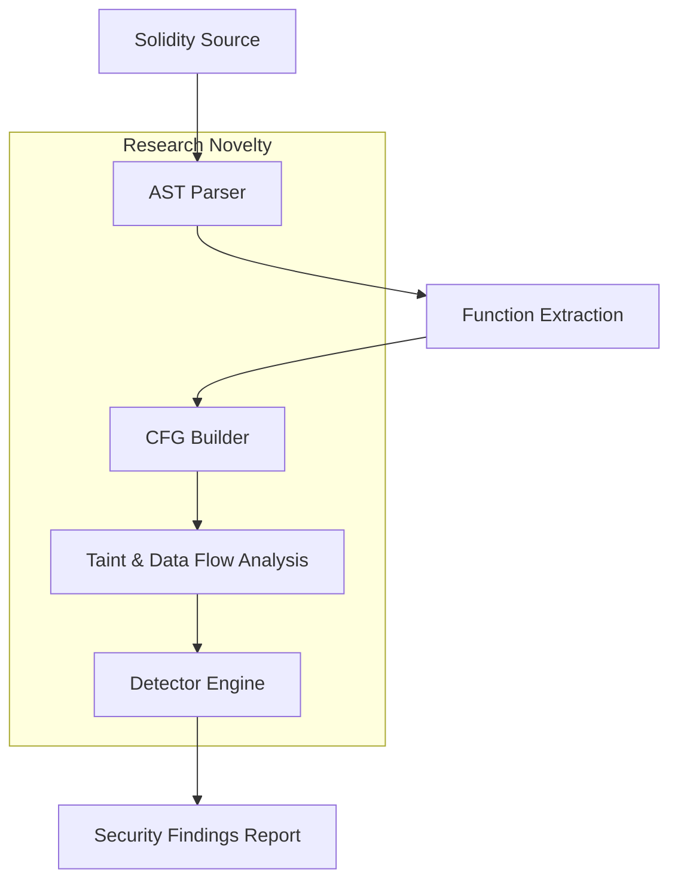

# EthSAST: Advanced Static Analysis for Ethereum Smart Contracts

## Project Overview

EthSAST is an advanced Static Application Security Testing (SAST) tool for Solidity smart contracts, designed for academic research and portfolio-grade web3 security engineering. It combines Python-based AST parsing and Control Flow Graph (CFG) generation with rule-based detectors and taint flow analysis to identify complex logic flaws that simple regex scanners miss.

## Architecture & Logic

EthSAST separates responsibilities into three core layers:

1. Solidity ingestion and parsing
2. CFG construction and data-flow modeling
3. Detector engine for security properties

### Solidity Parsing

The Python engine uses `tree-sitter` with the Solidity grammar to parse source code into a precise Abstract Syntax Tree (AST). This parser is robust across Solidity versions and provides structured AST nodes for functions, expressions, statements, and modifiers.

The parser pipeline looks like:

- Read Solidity source file
- Parse with `tree_sitter.Parser`
- Extract top-level function definitions, modifiers, and contract declarations

### Control Flow Graph (CFG) Construction

The CFG builder converts the AST for each function into a directed graph of basic blocks. It models control constructs such as:

- `if` branches
- `for` / `while` loops
- conditional expressions
- external calls and state writes

Each CFG node carries the source slice and AST metadata so detectors can analyze execution paths and find vulnerabilities along actual control flows.

### Taint Analysis

A formal taint-tracking model is used to propagate untrusted inputs to sensitive sinks.

#### Logical definition

Let `S` be the set of source expressions: `{ msg.sender, msg.value, tx.origin, msg.data, call.data }`.
Let `T` be the taint propagation relation over variables and expressions.

We define:

- `taint(x) := true` if `x` is directly assigned from a source in `S`
- `taint(y) := taint(x)` for any assignment `y = f(x)` where `f` is a data-flow-preserving expression
- A sink `sink(z)` is sensitive if `z` appears in low-level calls, external transfers, or state-changing conditions

A vulnerability is flagged when `taint(z)` reaches `sink(z)` along a CFG path.

### Detector Engine

The engine runs production-grade detectors over the AST/CFG, including:

- Reentrancy detection: external calls before state updates
- Timestamp dependence: use of `block.timestamp`, `block.number`, or `now`
- Unchecked return values: low-level calls without explicit checks
- Access control flaws: unguarded initialization or public state-modifying functions

## Mathematical / Logical Flow for Taint Analysis

1. Identify sources `S = { msg.sender, tx.origin, msg.value, msg.data, call.data }`
2. Identify propagation rules:
   - `x = y` implies `taint(x) := taint(y)`
   - `x = f(y1, y2, ..., yn)` implies `taint(x) := OR(taint(yi))`
3. Identify sinks `K = { .call(), .delegatecall(), .send(), .transfer() }`
4. For each path in the CFG, propagate taint information and report if a sink receives tainted input.

## Detector Implementation

The backend engine is centered in `backend/sast_engine.py`.

It contains:

- `SolidityASTParser` to load `tree-sitter` Solidity grammar and parse source text
- `CFGBuilder` to create a list of control-flow nodes and edges for each function
- `TaintAnalyzer` to propagate taint through statements and identify tainted sinks
- `SoliditySASTEngine` to run detectors and aggregate findings

## Threat Model

### Attacker Capabilities

- The attacker can deploy or interact with smart contracts on Ethereum-like chains
- The attacker can supply malicious arguments or malformed calldata
- The attacker can control transaction ordering and timing within miner-influenced bounds

### Assumptions

- Source code is static and available for analysis prior to deployment
- The tool is run as part of a secure CI/CD pipeline before contract publication
- The analysis engine is intended to detect design flaws, not replace runtime auditing

### Security Goals

- Detect reentrancy vulnerabilities that arise from external calls preceding state updates
- Catch timestamp-dependent logic that may be manipulated by miners
- Flag low-level call sites where return values are not properly verified
- Surface access control weaknesses in initialization and public state-modifying functions

### Out of Scope

- Formal verification of entire contract semantics
- Dynamic runtime behaviors such as flashloan exploitation at execution time
- Decompilation of deployed bytecode

## Mermaid Architecture Diagram



## Research Novelty

EthSAST emphasizes formal program structure rather than surface-level pattern matching. Key novel contributions include:

- AST-driven analysis of Solidity semantics across versions
- CFG generation for precise path-sensitive checks
- Taint propagation from user-controlled sources to sensitive sinks
- A research-ready architecture designed for top-tier academic portfolios

## Getting Started

### Backend setup

```bash
cd eth-sast/backend
python -m venv .venv
.\.venv\Scripts\Activate.ps1
pip install -r requirements.txt
```

Build the Solidity tree-sitter grammar and shared library:

```bash
cd eth-sast/backend
python build_grammar.py
```

Analyze the sample contract:

```bash
python sast_engine.py
```

### Run the Web API

```bash
cd eth-sast/backend
.\.venv\Scripts\Activate.ps1
uvicorn app:app --reload --host 0.0.0.0 --port 8000
```

### Frontend dashboard

Install dependencies and run the dashboard:

```bash
cd eth-sast/frontend
npm install
npm run dev
```

Open `http://localhost:5173` and paste Solidity source into the dashboard.

## Project Structure

- `backend/` — Python analysis engine and FastAPI service
- `backend/sast_engine.py` — AST parsing, CFG construction, and vulnerability detectors
- `backend/app.py` — REST API endpoint for static analysis
- `backend/build_grammar.py` — helper to build the Tree-sitter grammar
- `backend/sample/Example.sol` — example Solidity contract for testing
- `frontend/` — React + TypeScript dashboard for analysis results

## Publish-Ready Repository Checklist

- [x] `backend/requirements.txt` contains runtime and test dependencies
- [x] `backend/tests/` includes unit coverage for analysis logic
- [x] `Dockerfile` and `docker-compose.yml` provide containerized deployment
- [x] `.github/workflows/ci.yml` runs backend tests and frontend builds
- [x] `LICENSE`, `SECURITY.md`, and `CODE_OF_CONDUCT.md` are included
- [x] `README.md` documents installation, usage, and architecture

## Docker Support

Use Docker Compose to run the backend and frontend together:

```bash
docker-compose up --build
```

Then open the frontend at `http://localhost:5173` and analyze Solidity source against the backend service at `http://localhost:8000`.

## Publishing Advice

- Create a Git tag for the release, e.g. `v1.0.0`
- Push the branch and tag to GitHub
- Review the CI run in GitHub Actions to ensure backend tests and frontend build succeed
- Add a release note summarizing detection capabilities and the Solidity grammar support

## Release Checklist

- [x] Backend parser grammar builds successfully with `backend/build_grammar.py`
- [x] Backend tests pass under `backend/tests/`
- [x] Frontend dashboard builds successfully with `npm run build`
- [x] Docker and docker-compose launch the backend and frontend services
- [x] `LICENSE`, `SECURITY.md`, `CODE_OF_CONDUCT.md`, and `CONTRIBUTING.md` are present

## Next Steps

- Extend dashboard filtering and query controls
- Add cross-contract call graph and inter-contract analysis
- Integrate the backend into CI pipelines for pull request scanning
